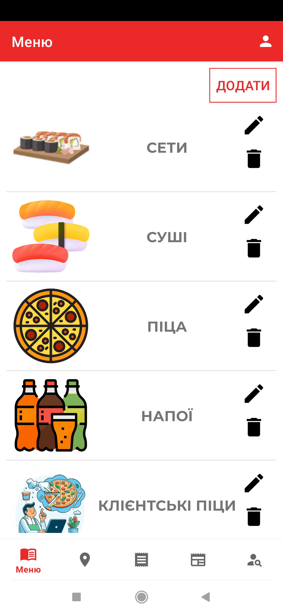
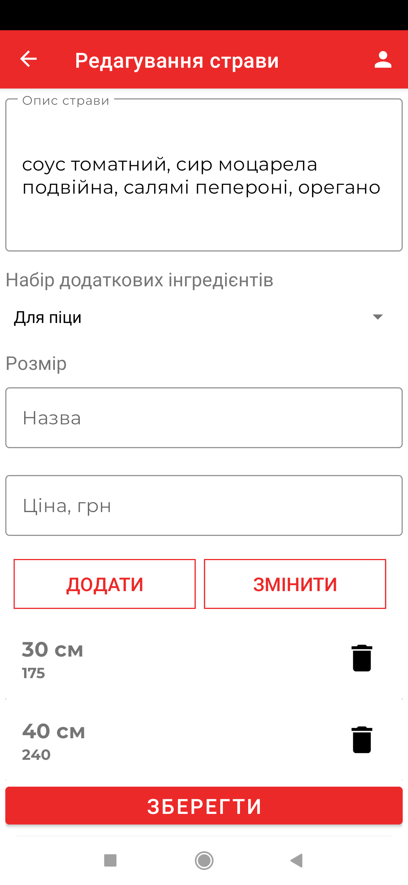
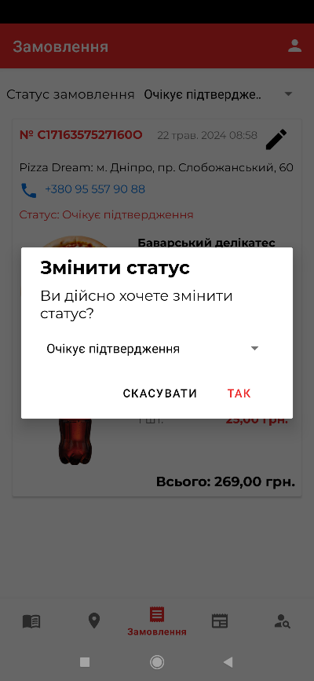

# PizzaDream Admin Panel

The administrative companion app for the PizzaDream ecosystem. This application is used by managers and staff to manage the content of the client application and process incoming orders.

> **Note:** Developed as part of a **Bachelor's Thesis project (2024)**.

## Features

* **Content Management (CMS):**
    * **Menu:** Add, edit, and delete pizza categories and food items.
    * **News:** Publish and manage news & promotions.
    * **Vacancies:** Manage job openings and view received resumes.
* **Order Management:** View incoming orders and update their status (e.g., update from "Placed" to "Shipped"), which instantly reflects in the Client App.
* **User Management:** Appoint new administrators and manage roles.
* **Server Side:** Uses Firebase Cloud Functions for backend logic notification triggers.

## Tech Stack

* **Language:** Kotlin
* **Architecture:** MVVM (Model-View-ViewModel)
* **Backend:** Firebase (Firestore, Realtime Database, Auth)
* **Networking:** Retrofit, FCM (Firebase Cloud Messaging) for push notifications.
* **Reactive:** RxJava / Coroutines

## 📸 Screenshots

| Edit Categories | Edit Food (Main Info) | Edit Food (Sizes/Addons) | Update Order Status |
|:---:|:---:|:---:|:---:|
|  |  |  |  |

## Author

**Tetiana Sokolianska**
*Dnipro National University*
